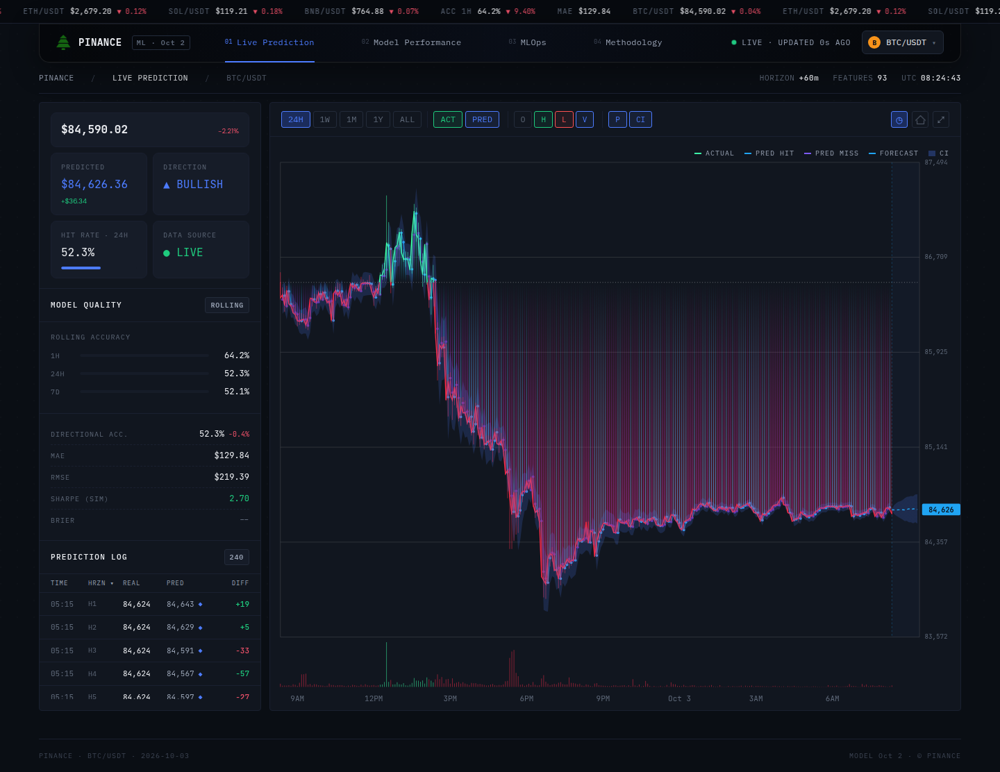
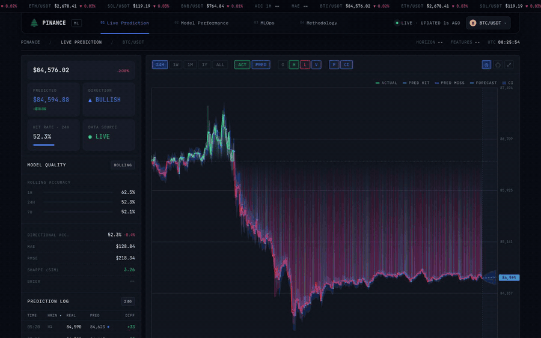
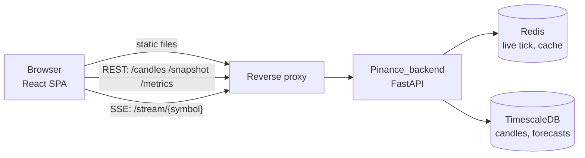
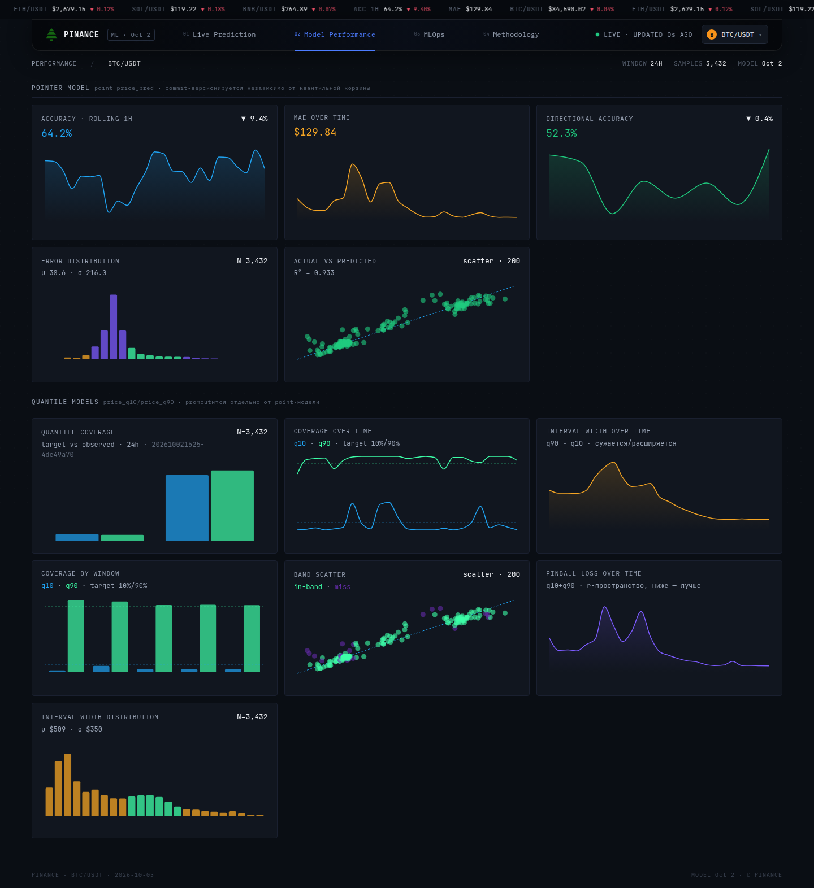
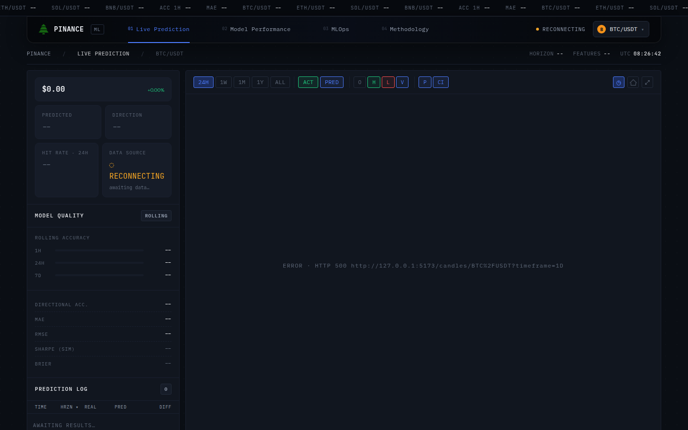
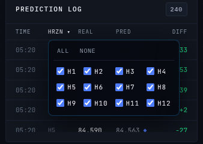

# Pinance Frontend

Web interface of **Pinance**, a real-time crypto price-forecasting system: a live candlestick chart with the model's 12-step forecast and confidence corridor drawn ahead of the price, and pages that show how good the model actually is, measured on its own past forecasts.

Live deployment: <https://pinance.katzer.ru/> (BTC, ETH, SOL, BNB against USDT). It may run an earlier build than this repository.



*Live Prediction tab, BTC/USDT, 24H view, captured on 2026-10-03 (about 08:25 UTC) from a local build of this repository reading the live backend. The dashed line and shaded corridor at the right edge are the forecast for the next 60 minutes; the cyan/violet lines under the price are past forecasts that were right/wrong about direction.*

> **Not a trading signal and not financial advice.** Forecasting crypto on a 5-minute horizon is close to the limit of predictability, and this interface is built to say so: it puts the measured hit rate next to every forecast instead of hiding it.

## What this project demonstrates

- **Honest quality display.** Directional accuracy for BTC/USDT over the last 24 h is **52.3 %** (3,432 forecast rows; 7 d: 52.0 %, 30 d: 52.7 %, all time: 52.5 %), shown on the main page next to the forecast. Source: [`docs/examples/metrics-summary-BTCUSDT.json`](docs/examples/metrics-summary-BTCUSDT.json), taken 2026-10-03 08:05 UTC.
- **Corridor calibration is visible.** The 10 %/90 % corridor observed 8.57 % / 95.54 % coverage over 24 h (target 10 % / 90 %, n = 3,432); over all time 4.45 % / 91.31 % (n = 171,430). The corridor is drawn, and its calibration is charted.
- **MLOps made visible.** The retrain timeline lists promote/reject decisions for the point model and the corridor model as two separate tracks, with version, time and sample count.
- **Resilient live data.** Server-Sent Events with a silence watchdog (45 s) and fetch timeouts (15 s), so a half-dead proxy connection cannot freeze the chart unnoticed.
- **A hand-built SVG price chart** that stays responsive with thousands of candles (the ALL view holds 3,075 daily candles). The whole app builds to 700 kB JS (206 kB gzip), with no automated tests (see [Limitations](#limitations-and-roadmap)).

## Contents

[Idea](#idea) · [Features](#features) · [How it works](#how-it-works) · [What the interface shows today](#what-the-interface-shows-today) · [Quick start](#quick-start) · [Usage examples](#usage-examples) · [Configuration](#configuration) · [API used](#api-used) · [Repository layout](#repository-layout) · [Tests and quality](#tests-and-quality) · [Deployment](#deployment) · [Limitations and roadmap](#limitations-and-roadmap) · [Related repositories](#related-repositories) · [License and credits](#license-and-credits)

## Idea

Most price-prediction demos show a forecast line and nothing else. Here the forecast is the smallest part of the screen. The interface answers a different question: *how good is this model, honestly, right now?* Every forecast is later compared with the price that actually happened, and those comparisons (hit rate, error, corridor coverage, retrain decisions) are rendered next to the live chart.

Two decisions follow from that:

1. **Metrics are computed once, on the backend**, and the frontend only renders them. An earlier version kept the latest results in each browser tab's memory, so every open tab showed a different hit rate for the same symbol.
2. **Gaps are shown as gaps.** A missing metric is `--`, an unreachable backend is an error text in the chart area, and a panel whose endpoint does not exist yet says so. The interface does not fill the space with plausible numbers.

## Features

Full descriptions of every card, button and metric: [`docs/features.md`](docs/features.md). Summary:

| Area | What it does | Evidence |
|---|---|---|
| **Live chart (24H)** | 5-minute candles, live tick over SSE, volume bars, area coloured green/red relative to the period's first open | [`live-prediction.png`](docs/media/live-prediction.png) |
| **Forecast overlay** | 12 forecast steps (+5 … +60 min) as a dashed line and a q10–q90 corridor widening to the right | [`chart-tooltip-forecast.png`](docs/media/chart-tooltip-forecast.png) |
| **Past-forecast trail** | One line per past forecast, cyan if the direction was right, violet if wrong, plus the past corridor (24H and 1W) | [`chart-tooltip-history.png`](docs/media/chart-tooltip-history.png) |
| **Timeframes** | 24H (5 m), 1W (15 m), 1M (1 h), 1Y and ALL (1 d); only 24H is live | [`chart-1w-rest.png`](docs/media/chart-1w-rest.png) |
| **Chart controls** | ACT/PRED layer toggles, O/H/L/V tooltip rows, P and CI tooltip toggles, go-live, reset, fullscreen; a settings menu on mobile | [`chart-tour.gif`](docs/media/chart-tour.gif) |
| **Snapshot tiles** | Price, predicted price at +60 min, direction, hit rate for the active timeframe, data-source status | [`live-prediction.png`](docs/media/live-prediction.png) |
| **Model quality block** | Rolling accuracy 1 h / 24 h / 7 d, directional accuracy, MAE, RMSE, simulated Sharpe | same |
| **Prediction log** | Up to 240 resolved forecasts (12 horizons × 20 candles), sortable, filterable by horizon, marked if the outcome fell inside the corridor | [`prediction-log-horizon-filter.png`](docs/media/prediction-log-horizon-filter.png) |
| **Ticker tape** | Live prices for four pairs, rolling 1 h accuracy and 24 h MAE; seamless loop at constant speed | top of every screenshot |
| **Model Performance tab** | 12 charts split into the point model and the quantile (corridor) model | [`model-performance.png`](docs/media/model-performance.png) |
| **MLOps tab** | Serving model/schema version, last and next retrain, retrain timeline, corridor calibration, inference latency, feature-drift panel, experiment-tracker link | [`mlops.png`](docs/media/mlops.png) |
| **Four symbols** | BTC, ETH, SOL, BNB against USDT, switchable from the top bar | [`pair-menu.png`](docs/media/pair-menu.png), [`pair-and-tabs.gif`](docs/media/pair-and-tabs.gif) |
| **Deep links** | The active tab lives in the URL (`?tab=perf`, `?tab=ops`, `?tab=meth`); browser back/forward work | [Usage examples](#usage-examples) |
| **Mobile layout** | Single-column grid below 1100 px, icon-only tabs and a compact tooltip bar below 768 px | [`mobile-live.png`](docs/media/mobile-live.png) |
| **Empty and error states** | `LOADING…`, `ERROR · HTTP …`, `NO DATA`, `RECONNECTING`, `AWAITING RESULTS…` | [`no-backend-live.png`](docs/media/no-backend-live.png), [`no-backend-mlops.png`](docs/media/no-backend-mlops.png) |

A fourth tab, **Methodology**, is a static page summarising the data, the model, the evaluation and the MLOps loop in plain language, consistent with the training repository.



*Hover tooltips on the 24H chart and the timeframe switch, recorded from a local build reading the live backend. Each timeframe is a separate REST load; only 24H streams.*

## How it works



The frontend is a static single-page app. In production a reverse proxy serves the built files and routes the API paths of the same domain to the backend; in development Vite proxies those paths ([deployment](docs/deployment.md)).

**Data flow on the Live tab.** The shell opens one SSE stream for the active symbol (ticker, header, model badge). While the 24H timeframe is selected the chart opens a second stream, loads candles, the latest forecast and the forecast history over REST, and re-polls the history and the prediction log every 30 s as a safety net. Other metrics are re-fetched every 45 s. Details and a sequence diagram: [`docs/architecture.md`](docs/architecture.md).

**Key design decisions** (reasoning, alternatives and rejected options: [`docs/design-decisions.md`](docs/design-decisions.md)):

- **The backend computes metrics; the frontend renders them.** One source of truth, identical numbers in every tab.
- **A watchdog instead of trusting `onerror`.** The backend sends a ping every 15 s; 45 s of silence (three missed pings) forces a reconnect, because a proxy can hold a dead socket open without the browser reporting an error.
- **The price chart is custom SVG, not a chart library.** The forecast corridor, the past-forecast trail and the future zone need control that generic libraries do not give, and the candle layer is memoised on primitive props so pointer tracking stays smooth. The performance pages use Recharts, where the generic charts are enough.
- **Hover is computed with arithmetic, not hit-testing.** Candle shapes ignore pointer events; the tooltip index is calculated from the cursor position, because hit-testing 15,000 SVG nodes on every move made the tooltip lag.
- **Client-side hit/miss as a fallback.** If the backend's resolved result is late or missing, the chart resolves a forecast itself when its target candle closes; the backend's result overrides it when it arrives.
- **Tab state in the query string, not the path.** Reloading never depends on SPA fallback rules on the server.

## What the interface shows today

Numbers below are read from the live backend for BTC/USDT on 2026-10-03 08:05 UTC ([source files](docs/examples/)). They change every minute; the screenshots in this repository were captured within about ten minutes of this snapshot and may differ by a fraction of a percent.

| Window | Directional accuracy | MAE (USD) | Forecast rows (n) | q10 coverage (target 10 %) | q90 coverage (target 90 %) |
|---|---|---|---|---|---|
| 1 h | 75.8 % | 27.87 | 120 | 2.5 % | 100 % |
| 24 h | 52.3 % | 133.53 | 3,432 | 8.57 % | 95.54 % |
| 7 d | 52.0 % | 144.37 | 24,168 | 4.67 % | 91.55 % |
| 30 d | 52.7 % | 141.32 | 103,356 | 4.44 % | 91.99 % |
| all | 52.5 % | 128.67 | 236,206 (coverage: 171,430) | 4.45 % | 91.31 % |

How to read it:

- **`n` counts forecast rows, about 12 per 5-minute candle** (24 h: 286 candles × 12 horizons = 3,432), not independent observations; neighbouring horizons share most of their outcome. No confidence intervals are shown by the interface or computed here.
- **The 1 h row is 10 candles' worth of data** (the Sharpe sample size in the same file is 10), so 75.8 % is noise: the same endpoint returned 89.2 % about twenty minutes earlier. The interface shows it in the ticker (`ACC 1H`) and the first rolling-accuracy row anyway.
- **Longer windows sit at 52–53 %**, a few points above a coin flip and consistent with the limit of predictability stated above. The training repository evaluates this with a walk-forward protocol and baselines; this repository only displays the live result.
- **Corridor tails are not symmetric:** the lower bound (q10) catches fewer outcomes than intended over long windows (4.45 % against 10 %), while q90 is close to its target.
- **"Actual vs Predicted" on the Performance tab compares price levels** (R² = 0.932 in the screenshot). That number is dominated by the price level itself and says nothing about forecasting skill; the hit rate and MAE are the informative ones.



*Model Performance tab for BTC/USDT, 24 h window, captured on 2026-10-03 from a local build reading the live backend.*

## Quick start

Requires Node 20.19+ or 22.12+ (Vite 7), tested here with Node 26.10.0 and npm 11.19.1. The UI needs a running Pinance backend ([`Pinance_backend`](https://github.com/GKatzer/Pinance_backend)) or any server that implements the [API used](docs/api.md); there is no mock mode.

```bash
git clone https://github.com/GKatzer/Pinance_frontend.git
cd Pinance_frontend
npm ci
cp .env.example .env     # empty values: backend expected at http://localhost:8000
npm run dev              # http://127.0.0.1:5173
npm run build            # static files in dist/
```

Not run in this environment: the `git clone` (the rest was run in a clean copy of this directory). Real output of the other steps:

```text
$ npm run dev
VITE v7.3.6  ready in 161 ms
  ➜  Local:   http://127.0.0.1:5173/

$ npm run build
✓ 627 modules transformed.
dist/index.html                   0.51 kB │ gzip:   0.32 kB
dist/assets/index-Dix_NP7Z.css   32.73 kB │ gzip:   7.42 kB
dist/assets/index-ep4sox5m.js   700.10 kB │ gzip: 206.25 kB
(!) Some chunks are larger than 500 kB after minification. …
✓ built in 2.04s
```

**No backend on localhost:8000?** Point the dev server at another one, for example the public deployment (read-only requests):

```bash
VITE_DEV_API_PROXY=https://pinance.katzer.ru npm run dev
```

With this setting `curl http://127.0.0.1:5173/health` returned `{"status":"ok"}` and `/metrics/BTC%2FUSDT/summary` returned HTTP 200, so the proxy works. Without any backend, the pages stay up and show their empty and error states:



*Dev server started with default settings and nothing listening on port 8000.*

## Usage examples

**Deep links.** `/` opens Live Prediction; the other tabs are `/?tab=perf`, `/?tab=ops`, `/?tab=meth`.

**Reading the same API the UI reads** (public deployment, captured 2026-10-03; more in [`docs/api.md`](docs/api.md)):

```bash
curl -s "https://pinance.katzer.ru/metrics/BTC%2FUSDT/latency"
```
```json
{"window":"24h","n":286,"p50":119.1,"p95":737.4,"p99":864.5}
```

```bash
curl -s "https://pinance.katzer.ru/metrics/BTC%2FUSDT/drift"
```
```json
{"detail":"Not Found"}
```

The second one is expected: the backend does not implement the drift endpoint yet, so the Feature Drift panel shows its empty state.

```bash
curl -sN "https://pinance.katzer.ru/stream/BTC%2FUSDT" | head -3
```
```text
event: tick
data: {"symbol": "BTC/USDT", "ts": 1791014700000, "closed": false, "open": 84594.72, "high": 84614.01, "low": 84594.71, "close": 84614.01, "volume": 3.01572}
```

**UI scenarios** (screenshots and GIFs): switching pair and tab ([`pair-and-tabs.gif`](docs/media/pair-and-tabs.gif)), hover tooltips and timeframes ([`chart-tour.gif`](docs/media/chart-tour.gif)), filtering the prediction log by horizon:



*The `HRZN ▾` header opens a checkbox menu; rows without a horizon are never filtered out.*

## Configuration

All variables are read by Vite at build/start time (they are baked into the static bundle; changing them requires a rebuild). Verified against the code with `grep import.meta.env`.

| Variable | Meaning | Default | Required |
|---|---|---|---|
| `VITE_API_URL` | Base URL of the Pinance API. Empty = same origin as the page | empty | no |
| `VITE_DEV_API_PROXY` | Dev server only: backend that Vite proxies `/candles`, `/stream`, `/snapshot`, `/health`, `/ready`, `/metrics` to | `http://localhost:8000` | no |
| `VITE_MLFLOW_UI_URL` | Link shown as "Open MLflow UI" on the MLOps tab; the button is disabled when empty | empty | no |

Template: [`.env.example`](.env.example).

## API used

The frontend calls fourteen read-only REST endpoints (one of them, `/drift`, returns 404 today) and one SSE stream; none needs authentication. Full table, parameters, polling intervals and real sample responses: [`docs/api.md`](docs/api.md). Samples are stored in [`docs/examples/`](docs/examples/).

## Repository layout

```
src/
  main.jsx                     React entry point
  app/
    app.jsx                    shell: ticker, nav, tabs, pair selector, footer, tweaks panel
    screens.jsx                the four pages: LivePrediction, ModelPerformance, MLOps, Methodology
    charts.jsx                 hand-built SVG price chart (candles, forecast, corridor, tooltips)
    perf-charts.jsx            Recharts charts for the performance pages
    data.jsx                   pair list, formatters, model-version parser
    tweaks-panel.jsx           host-driven settings panel (accent colour, overlays)
    globals.css                theme, layout, responsive rules
    hooks/
      useEventSource.js        SSE with reconnect and silence watchdog (shell)
      usePriceStream.js        snapshot + live tick/prediction/result for the shell
      useLiveCandles.js        candles per timeframe, live buffer, forecast trail, prediction log
      usePairPrices.js         10 s polling of the latest candle for all pairs (ticker)
      useMetrics.js            /metrics/* fetch hooks
public/                        logo and icons
docs/
  features.md                  every card, button and metric
  architecture.md              data flow, hooks, rendering
  design-decisions.md          why it is built this way, what was rejected
  api.md                       endpoints used, with real responses
  deployment.md                production serving
  examples/                    real API samples and the media capture script
  media/                       screenshots and GIFs
index.html, vite.config.js, package.json, package-lock.json, .env.example, LICENSE
```

## Tests and quality

- **There are no automated tests**, no linter configuration and no type checking (plain JavaScript, JSX). The interface is checked manually against the backend.
- The only automated check that was run for this documentation is `npm run build` (succeeds, 627 modules, about 2 s).
- Screenshots and GIFs were produced by a script, [`docs/examples/capture-media.mjs`](docs/examples/capture-media.mjs), from a local build of this repository connected to the live backend (read-only), so they show real data. Only Chrome was used.

## Deployment

The reference deployment serves `dist/` from a reverse proxy (the Vite config names Caddy) and routes the API paths of the same domain to the backend, so the browser uses same-origin relative URLs and `VITE_API_URL` stays empty. SSE responses must not be buffered by the proxy. Details: [`docs/deployment.md`](docs/deployment.md).

The page loads three font families (IBM Plex Mono, DM Sans, JetBrains Mono) from Google Fonts (`fonts.googleapis.com`, `fonts.gstatic.com`), which is an external request on every first visit.

## Limitations and roadmap

Found by reading the code and checking the pages on 2026-10-03.

**Behaviours worth knowing**

- The **Brier** row is permanently `--` (no confidence score is exposed yet).
- **Sharpe (sim)** is a simulation on horizon 1 with sign-of-forecast positions; with `n = 286` for 24 h it swings widely (the same endpoint gave −3.01, +2.79 and −0.17 within 20 minutes), so it should not be read as a result.
- On **1W, 1M, 1Y and ALL** the `PREDICTED` and `DIRECTION` tiles show `--`, because the latest forecast is loaded only for 24H.
- **NEXT RETRAIN** is computed in the browser from schedule constants (point daily 03:00 UTC, corridor weekly Sunday 04:30 UTC) and the timeline. It shows `--` when no events were loaded, and `overdue / ALERT` when a track's newest decision is older than its last scheduled run.
- **Feature Drift** panel is empty: `/metrics/{symbol}/drift` returns 404 on the backend. The six curated features it will list are fixed in the code.
- **Tweaks panel** (accent colour, forecast overlay, volume) opens only on a message from a host editor (`postMessage`), so it is not reachable in a normal deployment.
- The Live tab requests `/metrics/{symbol}/summary` twice per 45 s (shell and page both hold the hook), and keeps two SSE connections on 24H. Harmless, but redundant.
- The retrain timeline labels can overlap when two events are close in time (visible in `mlops.png`).
- `LIVE · UPDATED Ns AGO` is the time since the browser last received a tick, and the label switches to `RECONNECTING` or `CONNECTING` when the stream is not open; it says nothing about how fresh the backend's forecasts are.
- Only Chrome was tested. The layout uses CSS `zoom` above 1920 px width.
- Several subtitle strings on the Performance tab are in Russian.
- The public deployment may still run an earlier build; this repository's current code no longer contains the hard-coded header values, mock event tape, fixed prices in the pair menu or inaccurate methodology text that earlier builds showed.

**Roadmap** (the first two are prepared in the code): render the drift table when the backend adds `/metrics/{symbol}/drift` (the hook and the table are in place); show Brier and calibration once the model exposes a confidence score; add a mock server so the UI can be shown without a backend; add automated tests.

## Related repositories

```
Binance WebSocket ─► backend (FastAPI, TimescaleDB, Redis) ──► predictions, live shadow metrics
                           │ candles                                   ▲
                           ▼                                           │ /admin/metrics
   Pinance_ml_training:  features ─► walk-forward ─► LightGBM ─► MinIO (candidate slot) ─► inference service
   (training)                                              │                    (shadow-serves it)
                                                           └─ promote_if_better ─► MinIO (production slot)
```

This repository (the web UI) reads the backend's REST and SSE API; it never talks to the model or storage directly.

| Repository | Role |
|---|---|
| [Pinance_ml_training](https://github.com/GKatzer/Pinance_ml_training) | features, validation, experiments, retraining, promotion |
| [Pinance_ml_inference](https://github.com/GKatzer/Pinance_ml_inference) | model-serving service; polls MinIO, serves production and shadow candidate |
| [Pinance_backend](https://github.com/GKatzer/Pinance_backend) | candle ingestion, API, prediction store, live metrics |
| **Pinance_frontend** (this) | web UI: live forecast, model performance, MLOps, methodology |

## License and credits

[MIT](LICENSE), copyright 2026 George Denisov.

Credits: developed together with [powelitelploti](https://github.com/powelitelploti). Author: George Denisov, [Telegram](https://t.me/denisov_george).

Built with React 19.2.4, Recharts 3.10.1, Vite 7.3.6 and Tailwind CSS 4.3.0. Market data originates from Binance; price data shown here comes through the Pinance backend.
