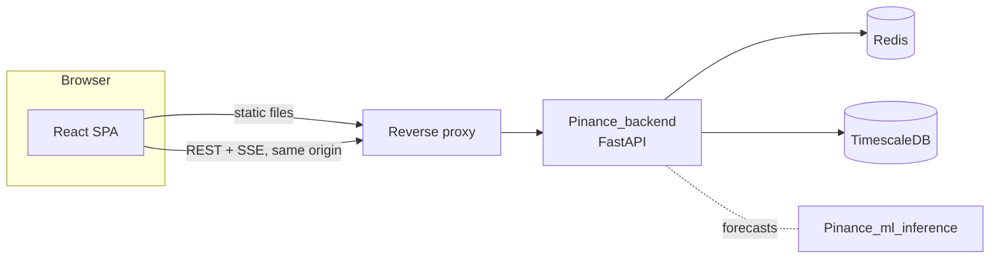
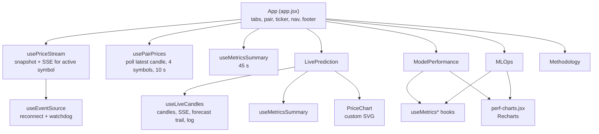
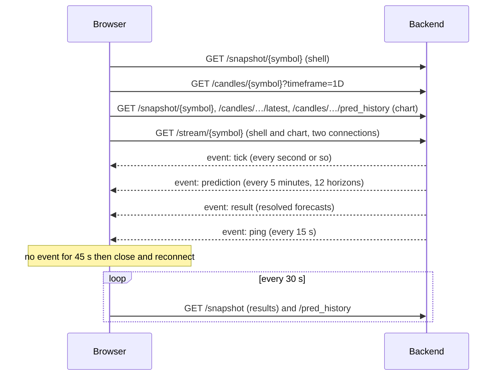

# Architecture

The frontend is a client-side React 19 application (JavaScript/JSX, Vite 7, Tailwind CSS 4 for the base layer plus a hand-written stylesheet). It has no router, no global store and no server-side rendering: state lives in hooks, and the only persistent client state is the URL (`?tab=`). Everything it shows comes from the Pinance backend over HTTP.

## System context

The browser only ever talks to the backend. Models, MinIO and the training pipeline are invisible to it; their effects arrive as `model_version`, `schema_version`, forecasts and retrain events in API responses.

## Component and hook map

| Module | Responsibility |
|---|---|
| `app.jsx` | Shell. Owns the active tab and pair, the ticker, the model badge parsed from the latest forecast, the connection indicator, the clock, the footer and the tweaks panel. Syncs the tab with the URL |
| `screens.jsx` | The four pages. `LivePrediction` owns chart settings (timeframe, layer toggles), the prediction-log filter and sort; `ModelPerformance` and `MLOps` map API responses to cards; `Methodology` is static |
| `charts.jsx` | `PriceChart` and its memoised layers: `CandleLayer`, `PredTrailLayer`; tooltips; axis labels; the mobile tooltip bar |
| `perf-charts.jsx` | Recharts wrappers: trend (area), histogram, coverage bars, coverage trend, two scatters |
| `hooks/useEventSource.js` | Generic SSE hook: connects, dispatches named events as parsed JSON, reconnects after 3 s, runs the watchdog |
| `hooks/usePriceStream.js` | Initial `/snapshot`, then live `tick`, `prediction`, `result` for the shell (results capped at 20 here; the page's own log holds 240) |
| `hooks/useLiveCandles.js` | The Live page's data: REST candles per timeframe, a mutable candle buffer for 24H, its own SSE stream, the forecast trail, pending-forecast resolution, the prediction log |
| `hooks/usePairPrices.js` | Polls `/candles/{symbol}/latest` for all pairs for the ticker |
| `hooks/useMetrics.js` | One small hook per `/metrics/*` endpoint on top of a shared `useJsonFetch` (keeps only the last response, optional interval, 15 s timeout) |
| `data.jsx` | `PAIRS`, the `fmt` number formatter and `parseModelVersion` |

Two SSE connections exist while the Live tab is on 24H (the shell's and the chart's), both to `/stream/{symbol}`. It was observed in the browser: a 75-second session on the live tab opened exactly two `/stream/` requests, one `/candles/{symbol}?timeframe=1D`, one `/candles/{symbol}/latest` extra for the chart, and the poll pattern in the next table.

## Request pattern on the Live tab

Measured with a browser session of 75 s against the deployment (request start times in seconds from page load):

| Request | Count in 75 s | Times |
|---|---|---|
| `/stream/{symbol}` | 2 | 3.6, 3.6 |
| `/snapshot/{symbol}` | 5 | 3.6, 3.6, 4.0, 33.6, 63.6 |
| `/candles/{symbol}/pred_history?horizon=1&hours=24` | 3 | 3.6, 33.6, 63.6 |
| `/candles/{symbol}/latest` | 33 | every 10 s for 4 symbols (+1 from the chart) |
| `/metrics/{symbol}/summary` | 4 | 3.6, 3.6, 48.6, 48.6 |

The summary is requested twice per interval because the shell and the Live page each hold the hook. The snapshot is requested by the shell once, and by the chart on mount, after the stream opens and every 30 s.

## Sequence: opening the Live tab on 24H

(The cadence of `tick` and `prediction` comes from observation and code comments; the sample in [`examples/sse-tick-sample.txt`](examples/sse-tick-sample.txt) shows ticks arriving several per second on a busy market.)

## Live buffer and forecast resolution

For 24H, `useLiveCandles` keeps a mutable buffer of up to 288 candles. A `tick` with the same `ts` as the last candle replaces it; a new `ts` closes the previous one and appends, dropping the oldest beyond 288. The buffer is copied into state on every tick.

Forecast resolution happens in two layers:

1. **Client estimate.** Each `prediction` event writes all 12 horizons into a map keyed by target-candle time (`anchor.ts + horizon × 5 min`), preferring the smaller horizon on collision, and prunes entries older than 15 candles. When a `tick` closes a candle that has an entry, the hit is computed locally and upserted into the trail.
2. **Backend result.** A `result` event for horizon 1 overwrites the point for that target time and deletes the pending entry. Independently, every 30 s `pred_history` is re-fetched and merged.

The trail is an array of `{ts, predicted, hit, q10, q90}` and is mapped to candle indices at render time (indices shift as the buffer slides).

## Price chart internals

`PriceChart` draws one SVG with a viewBox of 1080 × height (the height follows the panel through a `ResizeObserver`; on mobile the height is fixed in CSS and the SVG stretches). Layers, back to front: forecast trail, actual fill and line, candles and volume, past corridor, forecast band and line. The x axis reserves 12 extra slots on the right for the forecast even when it is hidden, so toggling `PRED` does not rescale the chart.

Performance measures, each in response to a measured symptom noted in the source comments:

- `CandleLayer` and `PredTrailLayer` are `React.memo` components that take only primitive props. Without that React still compared thousands of children on every hover render.
- Those layers set `pointer-events: none`. The hovered candle is calculated from the cursor position (arithmetic with the SVG scale and offset), so the browser does not hit-test tens of thousands of nodes per mouse move.
- Pointer events are coalesced with `requestAnimationFrame`: one state update per frame at most.
- Min/max price, the close path and volume maximum are `useMemo` with manual loops instead of spreading thousands of values into `Math.min`.
- Gaps in the forecast history (no resolved forecast for a candle) cut the connector line and the band instead of joining across the gap.

## Model Performance and MLOps data

Each card has its own fetch hook. Charts get arrays ready to plot (`points`, `counts` with `bin_edges`) and the page only maps them to Recharts props. Retrain timing is the only business logic in the browser: `RETRAIN_SCHEDULE` encodes the training pipeline's timers (point: daily 03:00 UTC, corridor: Sunday 04:30 UTC) and decides `NEXT RETRAIN` and `overdue`. The comment in the source states this is a deployment constant and should move to the backend if it ever exposes its own schedule.

## Styling and layout

Dark theme only; colours, fonts and spacing are CSS custom properties in `globals.css`, three Google fonts (IBM Plex Mono, DM Sans, JetBrains Mono). The accent colour is overridden at runtime from the tweaks value. `.container` applies CSS `zoom` that is 1 up to 1920 px viewport width and grows to 1.5 on larger screens, scaling the whole layout; pointer coordinates stay correct because they use `getBoundingClientRect`. Breakpoints: 1100 px (Live grid becomes one column), 1000 px (Performance grid two columns, MLOps single), 768 px (mobile chart, icon tabs), 700 px (single-column performance grid), 420 px (small phones).

## Prototype leftovers

The tweaks panel and the `EDITMODE` markers in `app.jsx` come from a design-tool host environment; the panel opens only on a host message. `globals.css` still contains the styles of the removed Event Tape (`.tape*`).

## Build

`npm run build` runs Vite: 627 modules, one JS chunk (700.10 kB, 206.25 kB gzip) and one CSS file (32.73 kB, 7.42 kB gzip). Vite warns about a chunk above 500 kB; nothing is code-split. Environment variables prefixed `VITE_` are replaced at build time.
