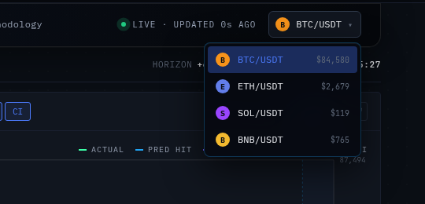
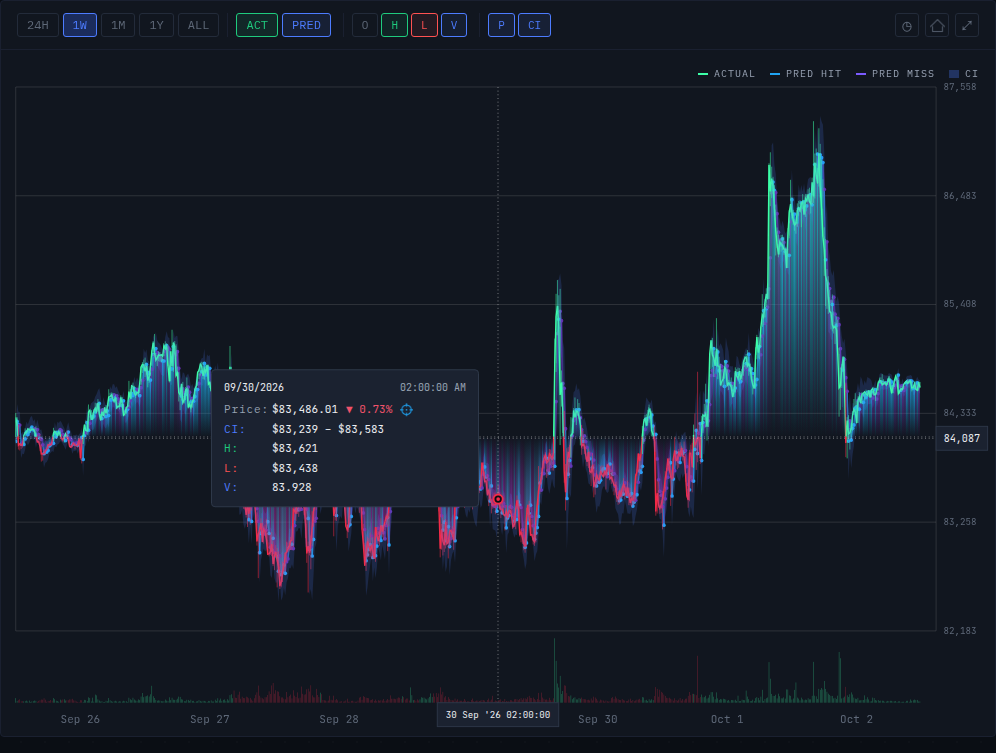
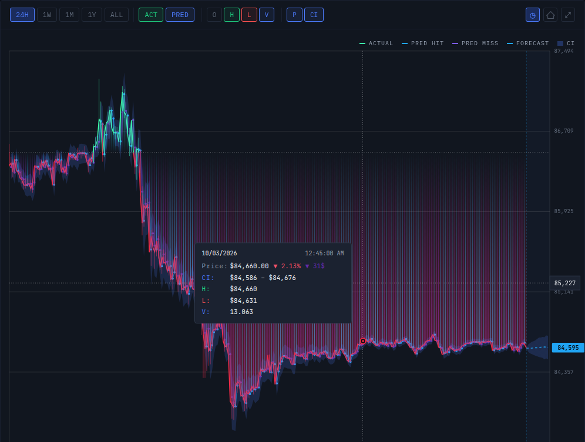
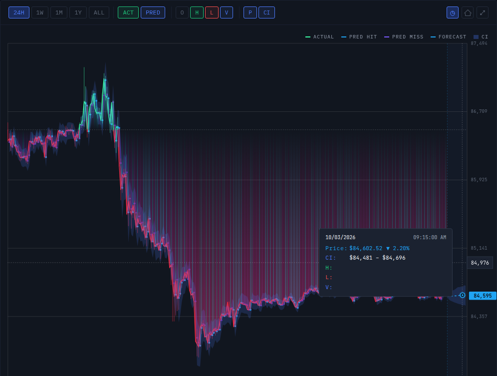
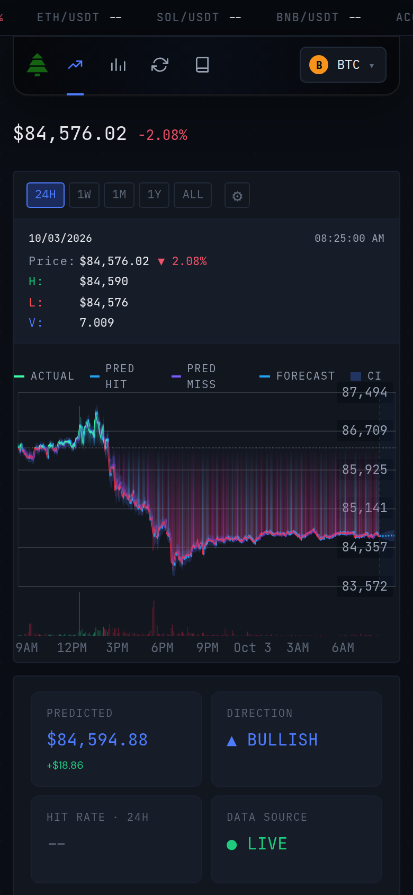
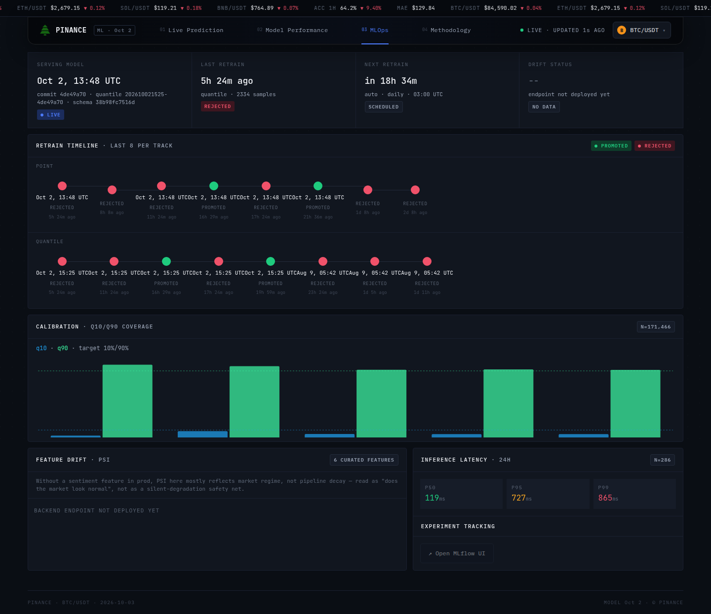
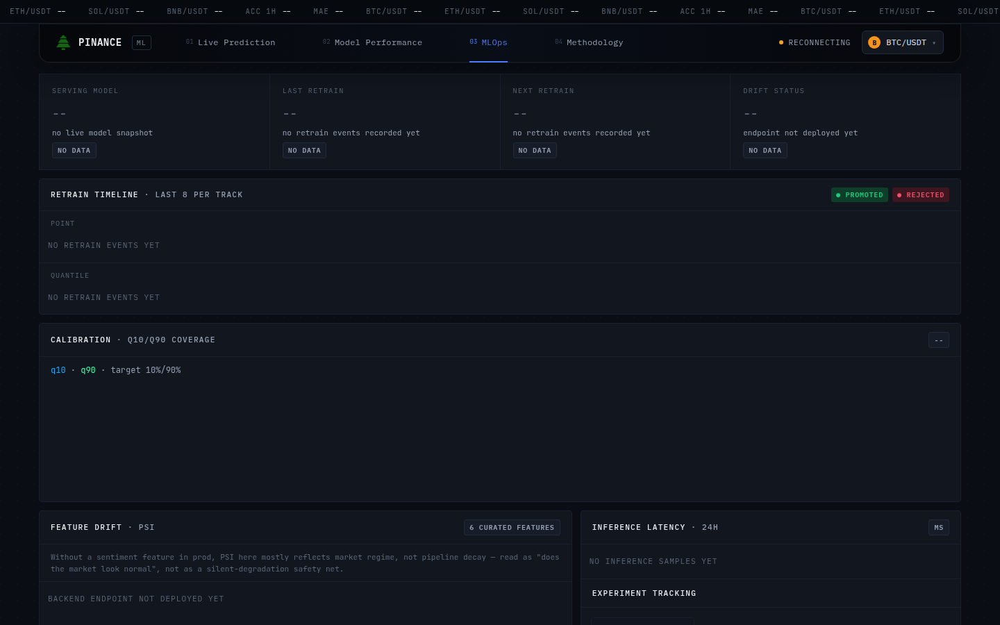

# Features, one by one

Every control, card and number in the interface, what it means and where it comes from. Screenshots were captured on 2026-10-03 (BTC/USDT) from a local build of this repository reading the live backend. Terms: **horizon** = how many 5-minute steps ahead a forecast looks (1 to 12); **q10/q90** = the lower and upper bound of the 80 % corridor (the 10th and 90th percentile of the model's forecast); **hit** = the forecast got the *direction* right.

Contents: [Shell](#shell-all-tabs) · [01 Live Prediction](#01-live-prediction) · [02 Model Performance](#02-model-performance) · [03 MLOps](#03-mlops) · [04 Methodology](#04-methodology) · [Resilience](#resilience-and-refresh-behaviour)

## Shell (all tabs)

- **Tabs.** `01 Live Prediction`, `02 Model Performance`, `03 MLOps`, `04 Methodology`. The active tab is written to the URL (`?tab=perf`, `?tab=ops`, `?tab=meth`; the default tab removes the parameter) with `pushState`, and back/forward restore it. Below 768 px the tabs show only icons.
- **Pair selector.** BTC, ETH, SOL, BNB against USDT. The choice applies to every tab. Each entry shows its live price: the active pair from the stream, the other three from the 10-second poll (`--` until the first answer).
  
- **Ticker tape** (top). For the four pairs: price and the move of the *current 5-minute candle* in percent, `(close − open) / open`; it is not a 24-hour change even though such tapes usually show that. The active pair updates over SSE, the other three by polling every 10 s. Two model items follow: `ACC 1H` (rolling directional accuracy over 1 h with its change in percentage points) and `MAE` (24 h mean absolute error in USD, without an arrow). The loop is seamless: the item set is repeated as many times as needed to fill the screen (measured with `ResizeObserver`) and the speed is fixed at 20 px/s, so wider screens get a longer loop, not a faster one.
- **Model badge** next to the logo: `ML · Oct 2` is the training date (UTC) parsed from the serving model's version. The tooltip shows the raw model version, the corridor-model version and the feature-schema id. With no live snapshot it shows `ML` and "no live model snapshot".
- **Connection indicator** (top right): `LIVE` with a pulsing green dot while the shell's SSE stream is open, `RECONNECTING` (amber dot) after an error, `CONNECTING` before the first connection; followed by `UPDATED Ns AGO`, the seconds since this browser last received a tick or snapshot.
- **Footer**: date and symbol, and the date of the serving model.
- **Tweaks panel** (accent colour: blue, violet, green, amber; forecast overlay on/off; volume on/off). It opens only when a host editor sends a `postMessage`, so in a normal deployment the defaults apply.

## 01 Live Prediction

### Page strip

`HORIZON` is the longest forecast horizon of the latest forecast in minutes (`+60m`: 12 steps × 5 min), `FEATURES` is the model's feature count from the same forecast (`93` on 2026-10-03), `UTC` is a clock. Without a live forecast the first two show `--`.

### Chart panel

**Timeframes** `24H`, `1W`, `1M`, `1Y`, `ALL` use candles of 5 m, 15 m, 1 h, 1 d and 1 d. Only `24H` is live: it opens an SSE stream, loads the latest forecast and refreshes forecast history and the prediction log every 30 s. The others are a single REST load per selection (the 1W view is shown below).

**What is drawn** (from back to front):

1. *Past-forecast trail* (24H and 1W only): for every past horizon-1 forecast a vertical gradient line from the forecast price to the baseline, plus a dot and a connector between consecutive forecasts. Cyan = the direction was right (`PRED HIT`), violet = wrong (`PRED MISS`). 1M, 1Y and ALL have no trail because the model's 5-minute horizon does not align with 1-hour or 1-day candles.
2. *Area and line of the actual price* (`ACTUAL`): green above and red below the first open of the visible period, so the colour answers "is the period up or down so far?".
3. *Candles*: wick and body, coloured the same way, plus volume bars at the bottom.
4. *Past corridor*: the q10–q90 band of past forecasts, drawn over the candles so it stays visible.
5. *Forecast* (`FORECAST`) and corridor (`CI`): a dashed line through the 12 forecast prices, and the q10–q90 band widening to the right, in a reserved 12-slot zone at the right edge. A badge shows the final predicted price.

*Hover over a past candle: date and time, price with its change against the period's first open, the forecast's corridor (`CI`) at that moment, and the rows enabled by the `O H L V` chips (by default high, low and volume).*

*Hover in the forecast zone: the predicted price for that future 5-minute step and its q10–q90 corridor.*

**Buttons**

| Button | Effect |
|---|---|
| `ACT` | shows/hides the actual-price layer (fill and line; candle bodies become fainter). Tooltip content is unaffected |
| `PRED` | shows/hides all forecast graphics: trail, past corridor, forecast line and future corridor |
| `O` `H` `L` `V` | add or remove open/high/low/volume rows in the tooltip only (default: H, L, V) |
| `P` | tooltip only: the predicted-price row on future points and hit/miss on past points |
| `CI` | tooltip only: the corridor row |
| `◷` | reset to live: selects `24H` |
| home icon | reset all chart settings to defaults (24H, all layers on, rows H/L/V) |
| `⤢` | browser fullscreen for the chart panel; `Esc` exits |
| `⚙` (mobile) | opens a menu with the ACT/PRED, O/H/L/V, P/CI and the three action buttons, which are hidden from the header on narrow screens |

*Mobile (390 px wide): price on its own line above the tape, tooltip as a fixed bar under the controls instead of a floating box.*

### Snapshot tiles (left)

| Tile | Meaning |
|---|---|
| Price + percentage | last close in the loaded range, and the change since the range's first open (so it changes with the timeframe) |
| `PREDICTED` | price forecast for the *last* horizon (+60 min) and its difference from the last close; `--` on 1W, 1M, 1Y and ALL, where no forecast is loaded |
| `DIRECTION` | `BULLISH` if that difference is ≥ 0, `BEARISH` otherwise; `--` where there is no forecast |
| `HIT RATE · <tf>` | directional accuracy from `/metrics/…/summary`; the window follows the timeframe: 24H → 24 h, 1W → 7 d, 1M → 30 d, 1Y and ALL → all (the backend keeps 90 days of forecasts, so these two are identical by construction) |
| `DATA SOURCE` | `LOADING…`, `● LIVE` (24H with an open stream), `◌ RECONNECTING` (24H, stream down), `REST · <tf>` |

### Model quality block

`ROLLING ACCURACY` shows 1 H, 24 H and 7 D directional accuracy as bars; the bar is green at 65 % or more, neutral from 55 %, amber below. Under it: `Directional Acc.` (24 h, with the change in percentage points), `MAE` and `RMSE` (USD, 24 h), `Sharpe (sim)` (24 h; the tooltip says: horizon 1, sign of forecast × actual return, annualised, with N), and `Brier`, which is always `--` because no confidence score exists yet. All figures come from one backend call; the frontend does not aggregate.

### Prediction log

One row per resolved forecast, newest first, up to 240 (12 horizons × 20 candles, the same cap as the backend). Columns: `TIME` (UTC time of the target candle), `HRZN` (`H1` … `H12`), `REAL` (actual price), `PRED` (forecast price) and `DIFF` (forecast − actual, green if the direction was right, red if wrong). A `◆` after the forecast means the actual price fell inside the 80 % corridor, `◇` outside; the tooltip shows the corridor. Clicking `TIME`, `REAL` or `DIFF` sorts (ascending, then descending). `HRZN ▾` opens a checkbox menu (`All`, `None`, `H1`–`H12`); the badge shows `shown/total`. Empty states: `AWAITING RESULTS…`, `NO HORIZONS SELECTED`.

### Client-side resolution of forecasts

The chart does not wait for the backend to mark a forecast right or wrong. Every `prediction` event registers all 12 horizons by target candle; when a candle closes, the pending forecast for it is resolved in the browser (`hit` = forecast and outcome are on the same side of the forecast's anchor close). The backend's `result` event or the 30-second re-poll overrides it when it arrives. The reason is in [design-decisions](design-decisions.md#client-side-hitmiss-as-a-fallback).

## 02 Model Performance

Header strip: `WINDOW 24H`, `SAMPLES` (forecast rows in the 24 h window, from the summary) and `MODEL` (training date of the serving model, `--` without a snapshot). Two sections:

**Pointer model** (the section title is spelled this way in the code; it is the point forecast, versioned independently of the corridor):

| Card | What it shows |
|---|---|
| Accuracy · Rolling 1h | latest 1 h directional accuracy with its change; the chart is hourly accuracy over the last 24 h |
| MAE Over Time | 24 h MAE as the headline; the chart is hourly MAE over 24 h |
| Directional Accuracy | 24 h accuracy with change; the chart is daily accuracy over 7 d |
| Error Distribution | histogram of forecast error in USD (24 bins, 24 h), mean (`μ`), standard deviation (`σ`) and `N` |
| Actual vs Predicted | up to 200 recent points of actual against predicted *price*, with R². The R² is computed on price levels, so it is dominated by the price itself; use accuracy and MAE to judge skill |

**Quantile models** (the corridor; versioned and promoted separately, the card shows the corridor model's version):

| Card | What it shows |
|---|---|
| Quantile Coverage | observed share of outcomes below q10 and below q90 in 24 h, against the targets 10 % and 90 %, with `N` |
| Coverage Over Time | the same two shares per hour over 24 h, with the targets as dashed lines |
| Interval Width Over Time | mean corridor width (q90 − q10) in USD per hour |
| Coverage by Window | the two shares for 1 h, 24 h, 7 d, 30 d, all |
| Band Scatter | the actual-vs-predicted scatter, points inside the corridor in green, misses in violet |
| Pinball Loss Over Time | pinball loss of q10 and q90 together, in return space, per hour (lower is better) |
| Interval Width Distribution | histogram of corridor width in USD (24 bins), mean, σ, `N` |

While a request is running a card shows `LOADING…`; after a failure or an empty answer, `NO DATA`. Hover tooltips show real bin ranges (`$X to $Y`) and timestamps in UTC.

## 03 MLOps

Four tiles:

| Tile | Meaning |
|---|---|
| `SERVING MODEL` | training time (UTC) of the point model, with commit, corridor-model version and feature-schema id; `● LIVE` badge. If the snapshot is missing or has expired, `--` and `NO DATA` rather than the last known version |
| `LAST RETRAIN` | time since the newest decision across both tracks, the track, the number of samples and a `PROMOTED`/`REJECTED` badge |
| `NEXT RETRAIN` | `in <time>` computed in the browser from fixed schedules (point: daily 03:00 UTC; corridor: weekly, Sunday 04:30 UTC, taken from the training pipeline's timers). `overdue` + `ALERT` if a track's newest decision is older than its last due time; `--` and `NO DATA` when no events were loaded |
| `DRIFT STATUS` | always `--`, "endpoint not deployed yet" |

**Retrain timeline.** The last eight decisions per track, point and quantile, as dots on a line: green = promoted, red = rejected, each with its candidate version time, the decision and "time ago". The timeline events come from `/metrics/…/retrain-timeline`.

**Calibration.** The coverage-by-window chart again (q10, q90, targets 10/90 %), with the all-time `N`.

**Feature drift (PSI).** A table of six curated features (`btc_ret`, `atr`, `bb_width`, `rsi`, `ret_std_144`, `macd_diff`) with PSI, status and a bar, shown when the backend provides the data. Until then, `BACKEND ENDPOINT NOT DEPLOYED YET`. A note on the panel says that without a sentiment feature in production the PSI mostly reflects market regime, not pipeline decay.

**Inference latency.** `P50`, `P95`, `P99` in milliseconds for the last 24 h with the number of samples, `NO INFERENCE SAMPLES YET` before any exist.

**Experiment tracking.** `↗ Open MLflow UI` opens the tracker in a new tab when `VITE_MLFLOW_UI_URL` is set; when empty the button is dimmed with an explanatory tooltip.

When the backend is unreachable this tab degrades to dashes and empty states:

*Dev server without a backend: every tile reads `--` and every panel shows its empty state; the indicator at the top right says `RECONNECTING`.*

## 04 Methodology

A static page in five numbered sections: data and features, model, evaluation, MLOps, caveats. It summarises the method as documented in the training repository (5-minute log-return target, twelve LightGBM regressors, separate quantile models for the corridor, walk-forward validation, daily/weekly retraining with shadow-gated promotion) and links to the three repositories. It does not quote numbers that change; the feature count is read from the live forecast and shown in the Live tab header.

## Resilience and refresh behaviour

| Mechanism | Behaviour |
|---|---|
| SSE reconnect | after an error the shell's stream reconnects after 3 s; the chart's stream uses the browser's native `EventSource` reconnect |
| Silence watchdog | checked every 10 s; no event (a `ping` counts) for 45 s forces a full reconnect. The backend pings every 15 s, so three misses are tolerated |
| Fetch timeout | 15 s per request |
| Pair prices | polled every 10 s |
| Metrics | summary, coverage, retrain timeline, latency, drift: every 45 s; the history/histogram/scatter cards: once per page visit |
| Prediction log and forecast history | re-polled every 30 s on 24H, and refreshed when the stream (re)opens. The periodic poll exists because a stream can stay open while the backend stops publishing results |
| Symbol or timeframe change | state and the pending-forecast map are reset and everything is reloaded |
